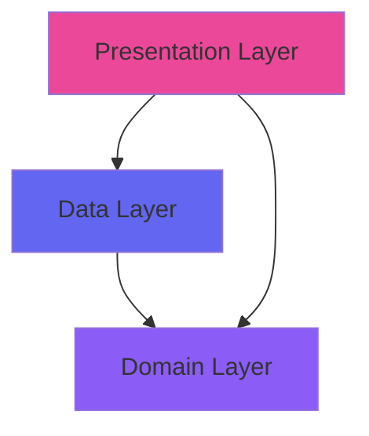
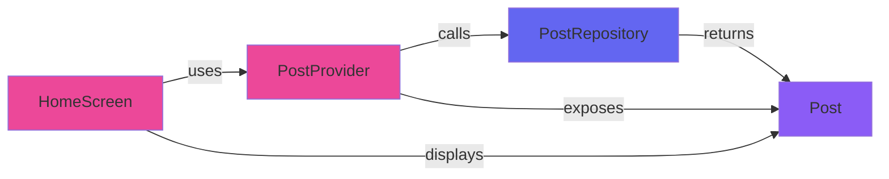
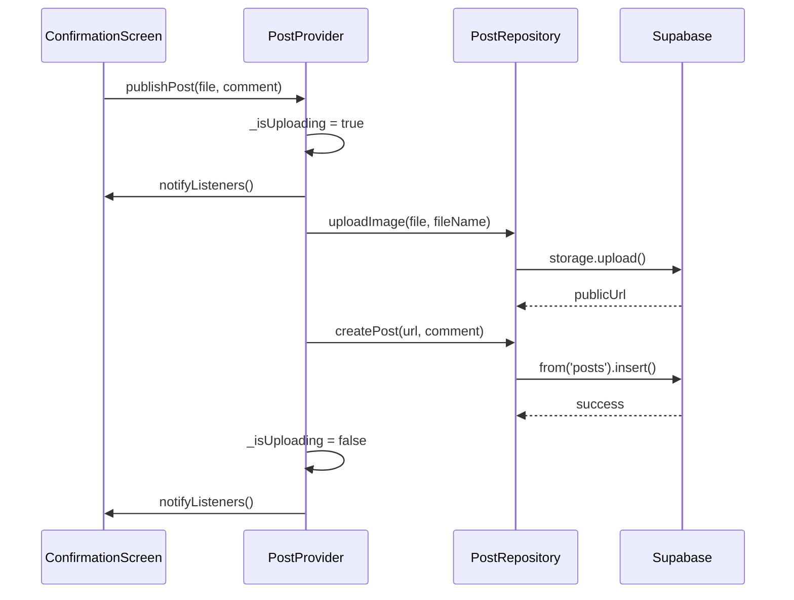

## Clean Architecture Principles

PhotoBoard implements Clean Architecture to create a maintainable, testable, and scalable codebase. The architecture is organized into three distinct layers with clear boundaries and dependency rules.


## Architecture Layers

### Layer Overview



<CardGroup cols={3}>
  <Card title="Domain" icon="gem" color="#8B5CF6">
    Core business logic
    <br/>Pure Dart, no dependencies
  </Card>
  <Card title="Data" icon="database" color="#6366F1">
    Data access layer
    <br/>Repositories & API calls
  </Card>
  <Card title="Presentation" icon="palette" color="#EC4899">
    UI & State
    <br/>Widgets & Providers
  </Card>
</CardGroup>

## Domain Layer

The Domain layer contains pure business logic and entities with **zero external dependencies**. This makes it the most stable and testable layer.

### Location
```
lib/features/posts/domain/
└── models/
    └── post.dart
```

### Post Model

The `Post` model represents the core business entity:

```dart title="lib/features/posts/domain/models/post.dart"
class Post {
  final String id;
  final String imageUrl;
  final String comment;
  final DateTime createdAt;

  Post({
    required this.id,
    required this.imageUrl,
    required this.comment,
    required this.createdAt,
  });

  /// Convert JSON (from Supabase) to Post object
  factory Post.fromJson(Map<String, dynamic> json) {
    return Post(
      id: json['id'].toString(),
      imageUrl: json['image_url'] as String,
      comment: json['comment'] as String,
      createdAt: DateTime.parse(json['created_at'] as String),
    );
  }

  /// Convert Post object to Map (for Supabase insert)
  Map<String, dynamic> toMap() {
    return {
      'image_url': imageUrl,
      'comment': comment,
    };
  }
}
```

### Domain Layer Characteristics

<AccordionGroup>
  <Accordion title="Pure Dart Classes">
    - No Flutter imports (`import 'package:flutter/...'`)
    - No external package dependencies
    - Only standard Dart libraries
    - Can run in pure Dart VM without Flutter
  </Accordion>

  <Accordion title="Business Rules">
    - Defines what a Post is
    - Handles data transformations (JSON ↔ Object)
    - Validates business constraints
    - No knowledge of UI or data sources
  </Accordion>

  <Accordion title="Testability">
    ```dart
    // Easy to test without Flutter TestBed
    test('Post.fromJson creates valid Post object', () {
      final json = {
        'id': '123',
        'image_url': 'https://example.com/photo.jpg',
        'comment': 'Test comment',
        'created_at': '2024-01-01T12:00:00Z',
      };
      
      final post = Post.fromJson(json);
      
      expect(post.id, '123');
      expect(post.comment, 'Test comment');
    });
    ```
  </Accordion>
</AccordionGroup>

## Data Layer

The Data layer handles all external data operations including API calls, database access, and file storage.

### Location
```
lib/features/posts/data/
└── repositories/
    └── post_repository.dart
```

### PostRepository

The repository encapsulates all data operations for Posts:

```dart title="lib/features/posts/data/repositories/post_repository.dart"
import 'dart:io';
import 'package:supabase_flutter/supabase_flutter.dart';
import '../../domain/models/post.dart';

class PostRepository {
  final SupabaseClient _supabase;

  PostRepository({SupabaseClient? supabaseClient})
      : _supabase = supabaseClient ?? Supabase.instance.client;

  /// Upload image to Supabase Storage and return public URL
  Future<String> uploadImage(File file, String fileName) async {
    final storagePath = 'public/$fileName';
    
    await _supabase.storage.from('photos').upload(storagePath, file);
    
    final String publicUrl = _supabase.storage
        .from('photos')
        .getPublicUrl(storagePath);
        
    return publicUrl;
  }

  /// Insert new post into 'posts' table
  Future<void> createPost(String imageUrl, String comment) async {
    final data = {
      'image_url': imageUrl,
      'comment': comment,
    };
    
    await _supabase.from('posts').insert(data);
  }

  /// Fetch all posts ordered by creation date
  Future<List<Post>> fetchPosts() async {
    final response = await _supabase
        .from('posts')
        .select()
        .order('created_at', ascending: false);
    
    return (response as List)
        .map((json) => Post.fromJson(json))
        .toList();
  }

  /// Real-time stream of posts
  Stream<List<Post>> fetchPostsStream() {
    return _supabase
        .from('posts')
        .stream(primaryKey: ['id'])
        .order('created_at', ascending: false)
        .map((maps) => maps.map((map) => Post.fromJson(map)).toList());
  }
}
```

### Repository Pattern Benefits

<CardGroup cols={2}>
  <Card title="Abstraction" icon="box">
    Hides implementation details of data storage from upper layers
  </Card>
  <Card title="Testability" icon="flask">
    Easy to mock for testing presentation layer
  </Card>
  <Card title="Flexibility" icon="arrows-spin">
    Swap data sources without affecting business logic
  </Card>
  <Card title="Single Source" icon="database">
    Centralized data access logic
  </Card>
</CardGroup>

### Data Operations

<Tabs>
  <Tab title="File Upload">
    ```dart
    // Upload image to Supabase Storage
    final imageUrl = await _repository.uploadImage(
      imageFile,
      'photo_${DateTime.now().millisecondsSinceEpoch}.jpg'
    );
    ```
    
    **Flow:**
    1. Receive File object from camera
    2. Generate unique filename with timestamp
    3. Upload to Supabase Storage bucket 'photos'
    4. Return public URL for database storage
  </Tab>
  
  <Tab title="Database Insert">
    ```dart
    // Insert post record into database
    await _repository.createPost(imageUrl, comment);
    ```
    
    **Flow:**
    1. Receive imageUrl and comment
    2. Create data map with required fields
    3. Insert into 'posts' table via Supabase client
    4. Database auto-generates id and created_at
  </Tab>
  
  <Tab title="Data Fetching">
    ```dart
    // One-time fetch
    final posts = await _repository.fetchPosts();
    
    // Real-time stream
    final stream = _repository.fetchPostsStream();
    ```
    
    **Flow:**
    1. Query 'posts' table
    2. Order by created_at descending (newest first)
    3. Map JSON responses to Post objects
    4. Return `List<Post>` or `Stream<List<Post>>`
  </Tab>
</Tabs>

### Dependency Injection

```dart
PostRepository({SupabaseClient? supabaseClient})
    : _supabase = supabaseClient ?? Supabase.instance.client;
```

<Note>
  The repository accepts an optional `SupabaseClient` for testing. In production, it defaults to the global instance. This enables easy mocking:
  
  ```dart
  // Testing
  final mockClient = MockSupabaseClient();
  final repository = PostRepository(supabaseClient: mockClient);
  ```
</Note>

## Presentation Layer

The Presentation layer contains all UI-related code including widgets, screens, and state management.

### Location
```
lib/features/posts/presentation/
├── providers/
│   └── post_provider.dart
├── screens/
│   ├── home_screen.dart
│   └── confirmation_screen.dart
└── widgets/
    └── post_card.dart
```

### PostProvider (State Management)

```dart title="lib/features/posts/presentation/providers/post_provider.dart"
import 'dart:io';
import 'package:flutter/material.dart';
import '../../data/repositories/post_repository.dart';
import '../../domain/models/post.dart';

class PostProvider extends ChangeNotifier {
  final PostRepository _repository;

  PostProvider(this._repository);

  bool _isUploading = false;
  bool get isUploading => _isUploading;

  /// Expose repository stream for real-time updates
  Stream<List<Post>> get postsStream => _repository.fetchPostsStream();

  Future<List<Post>> fetchAllPosts() => _repository.fetchPosts();

  /// Upload image and create post, managing loading state
  Future<void> publishPost(File imageFile, String comment) async {
    _isUploading = true;
    notifyListeners();

    try {
      final fileName = '${DateTime.now().millisecondsSinceEpoch}.jpg';
      
      // 1. Upload to Storage
      final imageUrl = await _repository.uploadImage(imageFile, fileName);
      
      // 2. Insert into database
      await _repository.createPost(imageUrl, comment);
      
    } catch (e) {
      print('Error publishing post: $e');
      rethrow;
    } finally {
      _isUploading = false;
      notifyListeners();
    }
  }
}
```

### UI Components

<Tabs>
  <Tab title="Screen">
    ```dart title="lib/features/posts/presentation/screens/home_screen.dart" {4,17,22}
    class HomeScreen extends StatelessWidget {
      @override
      Widget build(BuildContext context) {
        final postStream = context.read<PostProvider>().postsStream;

        return Scaffold(
          body: StreamBuilder<List<Post>>(
            stream: postStream,
            builder: (context, snapshot) {
              if (snapshot.connectionState == ConnectionState.waiting) {
                return CircularProgressIndicator();
              }
              
              final posts = snapshot.data ?? [];
              
              return ListView.builder(
                itemCount: posts.length,
                itemBuilder: (context, index) {
                  return PostCard(post: posts[index]);
                },
              );
            },
          ),
        );
      }
    }
    ```
  </Tab>
  
  <Tab title="Widget">
    ```dart title="lib/features/posts/presentation/widgets/post_card.dart" {8-10,15-16}
    class PostCard extends StatelessWidget {
      final Post post;

      const PostCard({required this.post});

      @override
      Widget build(BuildContext context) {
        final formattedDate = DateFormat('dd MMM yyyy')
            .format(post.createdAt);

        return Card(
          child: Column(
            children: [
              Image.network(post.imageUrl),
              Text(post.comment),
              Text(formattedDate),
            ],
          ),
        );
      }
    }
    ```
  </Tab>
</Tabs>

## Dependency Flow

The dependency rule ensures inner layers don't depend on outer layers:



### Dependency Inversion

<Steps>
  <Step title="Domain Layer">
    Defines `Post` model with no dependencies
    ```dart
    class Post { /* pure data class */ }
    ```
  </Step>
  
  <Step title="Data Layer">
    Repository depends on Domain (imports Post model)
    ```dart
    import '../../domain/models/post.dart';
    
    class PostRepository {
      Future<List<Post>> fetchPosts() { /* ... */ }
    }
    ```
  </Step>
  
  <Step title="Presentation Layer">
    Provider depends on both Data and Domain
    ```dart
    import '../../data/repositories/post_repository.dart';
    import '../../domain/models/post.dart';
    
    class PostProvider extends ChangeNotifier {
      final PostRepository _repository;
      Stream<List<Post>> get postsStream => /* ... */;
    }
    ```
  </Step>
</Steps>

## Separation of Concerns

Each layer has a single, well-defined responsibility:

<CardGroup cols={3}>
  <Card title="Domain" icon="gem">
    **What:**
    - Post entity
    - Data transformations
    
    **Not:**
    - Where data comes from
    - How it's displayed
  </Card>
  
  <Card title="Data" icon="database">
    **What:**
    - API calls
    - File uploads
    - Data mapping
    
    **Not:**
    - UI state
    - Business rules
  </Card>
  
  <Card title="Presentation" icon="palette">
    **What:**
    - UI components
    - User interactions
    - Loading states
    
    **Not:**
    - API details
    - Data storage
  </Card>
</CardGroup>

## Testing Strategy

Clean Architecture makes testing straightforward:

### Unit Tests

```dart
// Domain Layer - Pure logic testing
test('Post.fromJson converts JSON correctly', () {
  final json = {'id': '1', 'image_url': 'url', /* ... */};
  final post = Post.fromJson(json);
  expect(post.id, '1');
});

// Data Layer - Mock external dependencies
test('PostRepository.fetchPosts returns posts', () async {
  final mockClient = MockSupabaseClient();
  final repository = PostRepository(supabaseClient: mockClient);
  
  when(mockClient.from('posts').select())
      .thenReturn([/* mock data */]);
  
  final posts = await repository.fetchPosts();
  expect(posts.length, greaterThan(0));
});

// Presentation Layer - Mock repository
test('PostProvider.publishPost updates state', () async {
  final mockRepo = MockPostRepository();
  final provider = PostProvider(mockRepo);
  
  await provider.publishPost(mockFile, 'comment');
  
  expect(provider.isUploading, false);
});
```

## Benefits of Clean Architecture

<AccordionGroup>
  <Accordion title="Independent of Frameworks">
    Business logic doesn't depend on Flutter, Supabase, or any external library. You can:
    - Switch from Supabase to Firebase
    - Replace Provider with Bloc
    - Test without Flutter TestBed
  </Accordion>

  <Accordion title="Testable">
    Each layer can be tested independently:
    - Domain: Pure Dart unit tests
    - Data: Mock Supabase client
    - Presentation: Mock repository
  </Accordion>

  <Accordion title="Independent of UI">
    Business logic is separate from UI:
    - Reuse logic across platforms (mobile, web, desktop)
    - Change UI framework without touching business logic
    - Multiple UI implementations (Material, Cupertino)
  </Accordion>

  <Accordion title="Independent of Database">
    Repository pattern abstracts data source:
    - Switch from Supabase to local database
    - Add caching layer transparently
    - Support offline mode
  </Accordion>
</AccordionGroup>

## Real-World Example: Publishing a Post

Here's how all layers work together:



<Steps>
  <Step title="User Action" icon="hand-pointer">
    User taps "Compartir Voz" button in `ConfirmationScreen`
  </Step>
  
  <Step title="Presentation Layer" icon="palette">
    `PostProvider.publishPost()` is called:
    - Sets `_isUploading = true`
    - Notifies UI to show loading indicator
  </Step>
  
  <Step title="Data Layer" icon="database">
    `PostRepository` handles data operations:
    - `uploadImage()` uploads file to Supabase Storage
    - `createPost()` inserts record into database
  </Step>
  
  <Step title="Backend" icon="cloud">
    Supabase processes requests:
    - Stores image file in 'photos' bucket
    - Inserts row into 'posts' table
    - Triggers real-time event
  </Step>
  
  <Step title="Real-time Update" icon="bolt">
    Stream automatically updates:
    - `fetchPostsStream()` receives new post
    - `StreamBuilder` rebuilds UI
    - New post appears instantly
  </Step>
</Steps>

## Next Steps

<CardGroup cols={2}>
  <Card title="State Management" icon="bolt" href="./state-management">
    Learn how Provider manages UI state and real-time updates
  </Card>
  <Card title="Architecture Overview" icon="sitemap" href="./overview">
    Return to high-level architecture overview
  </Card>
</CardGroup>