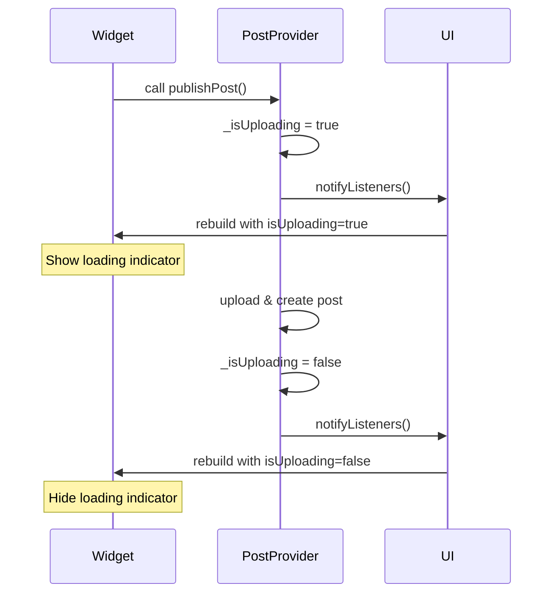
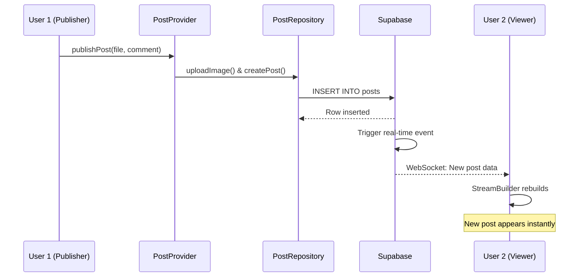

## State Management Overview

PhotoBoard uses **Provider** for state management, leveraging Flutter's `ChangeNotifier` pattern to create reactive, efficient UIs. This approach provides a clean separation between business logic and UI while maintaining simplicity.


## Why Provider?

<CardGroup cols={2}>
  <Card title="Official Solution" icon="flutter">
    Recommended by Flutter team, well-documented and maintained
  </Card>
  <Card title="Simple API" icon="code">
    Easy to learn with intuitive `context.watch()` and `context.read()`
  </Card>
  <Card title="Performance" icon="gauge-high">
    Efficient rebuilds - only widgets that depend on changed state
  </Card>
  <Card title="Integration" icon="puzzle-piece">
    Works seamlessly with Flutter's widget tree
  </Card>
</CardGroup>

## Provider Setup

### Application Root

Provider is initialized at the application root to make state available throughout the widget tree:

```dart title="lib/main.dart" {21-24}
void main() async {
  WidgetsFlutterBinding.ensureInitialized();

  await dotenv.load(fileName: "assets/.env");

  await Supabase.initialize(
    url: dotenv.env['SUPABASE_URL'] ?? '',
    anonKey: dotenv.env['SUPABASE_ANON_KEY'] ?? '',
  );

  runApp(
    ChangeNotifierProvider(
      create: (context) => PostProvider(PostRepository()),
      child: const PhotoBoardApp(),
    ),
  );
}
```

<Note>
  `ChangeNotifierProvider` creates an instance of `PostProvider` and makes it available to all descendant widgets. The provider is created only once and persists for the app's lifetime.
</Note>

### Dependency Injection

```dart
create: (context) => PostProvider(PostRepository())
```

This pattern enables:
- **Testability**: Easy to inject mock repositories for testing
- **Flexibility**: Swap implementations without changing UI code
- **Single Source of Truth**: One provider instance shared across the app

## PostProvider Implementation

The `PostProvider` class manages all post-related state using the ChangeNotifier pattern:

```dart title="lib/features/posts/presentation/providers/post_provider.dart"
import 'dart:io';
import 'package:flutter/material.dart';
import '../../data/repositories/post_repository.dart';
import '../../domain/models/post.dart';

class PostProvider extends ChangeNotifier {
  final PostRepository _repository;

  PostProvider(this._repository);

  // Loading state
  bool _isUploading = false;
  bool get isUploading => _isUploading;

  // Real-time posts stream
  Stream<List<Post>> get postsStream => _repository.fetchPostsStream();

  // One-time fetch
  Future<List<Post>> fetchAllPosts() => _repository.fetchPosts();

  /// Upload image and create post, managing loading state
  Future<void> publishPost(File imageFile, String comment) async {
    _isUploading = true;
    notifyListeners();  // Notify UI: show loading indicator

    try {
      final fileName = '${DateTime.now().millisecondsSinceEpoch}.jpg';
      
      // 1. Upload to Storage
      final imageUrl = await _repository.uploadImage(imageFile, fileName);
      
      // 2. Insert into database
      await _repository.createPost(imageUrl, comment);
      
    } catch (e) {
      print('Error publishing post: $e');
      rethrow;
    } finally {
      _isUploading = false;
      notifyListeners();  // Notify UI: hide loading indicator
    }
  }
}
```

## ChangeNotifier Pattern

### How It Works



### Key Concepts

<AccordionGroup>
  <Accordion title="ChangeNotifier">
    A class that provides change notification to its listeners.
    
    ```dart
    class PostProvider extends ChangeNotifier {
      // When state changes, call notifyListeners()
    }
    ```
    
    **Best Practices:**
    - Call `notifyListeners()` after state changes
    - Don't call it during widget build
    - Avoid excessive notifications (impacts performance)
  </Accordion>

  <Accordion title="notifyListeners()">
    Triggers rebuild of all widgets listening to this provider.
    
    ```dart
    _isUploading = true;
    notifyListeners();  // All listeners rebuild
    ```
    
    **When to call:**
    - After changing any state that affects UI
    - In `finally` blocks to ensure state consistency
    - After async operations complete
  </Accordion>

  <Accordion title="Private State">
    State variables are private with public getters:
    
    ```dart
    bool _isUploading = false;        // Private
    bool get isUploading => _isUploading;  // Public read-only
    ```
    
    **Benefits:**
    - Encapsulation: state can only be changed internally
    - Control: validation and business logic in setters
    - Immutability: external code can't modify state directly
  </Accordion>
</AccordionGroup>

## Consuming Provider in UI

### Reading State

There are two main ways to access provider state:

<Tabs>
  <Tab title="context.watch()">
    Use `context.watch()` when you need the widget to rebuild on state changes:
    
    ```dart title="lib/features/posts/presentation/screens/confirmation_screen.dart" {2,7}
    @override
    Widget build(BuildContext context) {
      // Rebuild when isUploading changes
      final isUploading = context.watch<PostProvider>().isUploading;

      return ElevatedButton(
        onPressed: isUploading ? null : _onPublish,
        child: isUploading 
            ? CircularProgressIndicator()
            : Text('Compartir Voz'),
      );
    }
    ```
    
    <Warning>
      `context.watch()` causes rebuilds. Only use in `build()` method and only watch state that affects the UI.
    </Warning>
  </Tab>
  
  <Tab title="context.read()">
    Use `context.read()` when you only need to call methods without listening to changes:
    
    ```dart title="lib/features/posts/presentation/screens/home_screen.dart" {3,5}
    class HomeScreen extends StatelessWidget {
      void _exportData(BuildContext context) async {
        // Read once, don't listen to changes
        final provider = context.read<PostProvider>();
        final posts = await provider.fetchAllPosts();
        
        // Export posts to CSV...
      }
    }
    ```
    
    <Note>
      `context.read()` doesn't cause rebuilds. Use it in event handlers, callbacks, and initState.
    </Note>
  </Tab>
  
  <Tab title="Provider.of()">
    Alternative syntax with explicit listen parameter:
    
    ```dart
    // Listen to changes (same as context.watch)
    final provider = Provider.of<PostProvider>(context, listen: true);
    
    // Don't listen (same as context.read)
    final provider = Provider.of<PostProvider>(context, listen: false);
    ```
    
    <Note>
      `context.watch()` and `context.read()` are preferred for clarity.
    </Note>
  </Tab>
</Tabs>

### Loading State Example

The confirmation screen shows a loading overlay during upload:

```dart title="lib/features/posts/presentation/screens/confirmation_screen.dart" {2,11-30}
@override
Widget build(BuildContext context) {
  final isUploading = context.watch<PostProvider>().isUploading;

  return Scaffold(
    body: Stack(
      children: [
        // Main content
        _buildForm(),
        
        // Loading overlay
        if (isUploading)
          Container(
            color: Colors.black45,
            child: Center(
              child: Column(
                mainAxisSize: MainAxisSize.min,
                children: [
                  CircularProgressIndicator(),
                  SizedBox(height: 24),
                  Text(
                    'Guardando tu reflexión...',
                    style: TextStyle(color: Colors.white),
                  ),
                ],
              ),
            ),
          ),
      ],
    ),
  );
}
```

**State Flow:**
1. User taps "Compartir Voz" button
2. `publishPost()` sets `_isUploading = true` and calls `notifyListeners()`
3. Widget rebuilds with `isUploading = true`
4. Loading overlay appears
5. Upload completes, `_isUploading = false`, `notifyListeners()`
6. Widget rebuilds with `isUploading = false`
7. Loading overlay disappears

## Stream-Based Real-Time Updates

### postsStream Getter

The provider exposes Supabase's real-time stream:

```dart title="lib/features/posts/presentation/providers/post_provider.dart" {3}
class PostProvider extends ChangeNotifier {
  // Expose repository stream
  Stream<List<Post>> get postsStream => _repository.fetchPostsStream();
}
```

### Repository Stream Implementation

```dart title="lib/features/posts/data/repositories/post_repository.dart" {3-6}
class PostRepository {
  Stream<List<Post>> fetchPostsStream() {
    return _supabase
        .from('posts')
        .stream(primaryKey: ['id'])  // Real-time subscription
        .order('created_at', ascending: false)
        .map((maps) => maps.map((map) => Post.fromJson(map)).toList());
  }
}
```

<Note>
  **Supabase Real-time:**
  - Automatically subscribes to database changes
  - Emits new data when rows are inserted, updated, or deleted
  - No polling required - uses WebSocket connection
  - Minimal latency for instant updates
</Note>

### Consuming Stream in UI

The `HomeScreen` uses `StreamBuilder` to display real-time posts:

```dart title="lib/features/posts/presentation/screens/home_screen.dart" {4,7-23}
@override
Widget build(BuildContext context) {
  // Get stream once, don't listen to provider changes
  final postStream = context.read<PostProvider>().postsStream;

  return Scaffold(
    body: StreamBuilder<List<Post>>(
      stream: postStream,
      builder: (context, snapshot) {
        if (snapshot.connectionState == ConnectionState.waiting) {
          return Center(child: CircularProgressIndicator());
        }
        
        if (snapshot.hasError) {
          return Center(child: Text('Error: ${snapshot.error}'));
        }
        
        final posts = snapshot.data ?? [];
        
        return ListView.builder(
          itemCount: posts.length,
          itemBuilder: (context, i) => PostCard(post: posts[i]),
        );
      },
    ),
  );
}
```

### StreamBuilder States

<Tabs>
  <Tab title="Waiting">
    ```dart
    if (snapshot.connectionState == ConnectionState.waiting) {
      return Center(
        child: CircularProgressIndicator(
          strokeWidth: 2,
        )
      );
    }
    ```
    
    **When:**
    - Initial connection to stream
    - First data fetch
    
    **Duration:**
    - Usually < 1 second
  </Tab>
  
  <Tab title="Error">
    ```dart
    if (snapshot.hasError) {
      return Center(
        child: Column(
          children: [
            Icon(Icons.wifi_off_rounded, size: 48),
            Text('Sin conexión. Revisa tu red.'),
          ],
        ),
      );
    }
    ```
    
    **Causes:**
    - No internet connection
    - Supabase service down
    - Invalid credentials
    - Network timeout
  </Tab>
  
  <Tab title="Data">
    ```dart
    final posts = snapshot.data ?? [];
    
    if (posts.isEmpty) {
      return Center(
        child: Text('No hay voces registradas aún'),
      );
    }
    
    return ListView.builder(
      itemCount: posts.length,
      itemBuilder: (context, index) {
        return PostCard(post: posts[index]);
      },
    );
    ```
    
    **Updates:**
    - Automatically when data changes
    - No manual refresh needed
    - Instant UI updates
  </Tab>
</Tabs>

## Real-Time Update Flow

Here's what happens when a new post is published:



<Steps>
  <Step title="Publish" icon="upload">
    User 1 publishes a post via `PostProvider.publishPost()`
  </Step>
  
  <Step title="Insert" icon="database">
    `PostRepository` inserts row into Supabase 'posts' table
  </Step>
  
  <Step title="Broadcast" icon="signal">
    Supabase broadcasts change to all subscribed clients via WebSocket
  </Step>
  
  <Step title="Update" icon="rotate">
    User 2's `StreamBuilder` receives new data and rebuilds automatically
  </Step>
</Steps>

<Note>
  **No manual refresh required!** The stream handles everything:
  - Subscribes to database changes
  - Receives real-time updates
  - Triggers UI rebuilds
  - Maintains correct order (newest first)
</Note>

## State Management Patterns

### Loading States

```dart
class PostProvider extends ChangeNotifier {
  bool _isUploading = false;
  bool get isUploading => _isUploading;
  
  Future<void> publishPost(File imageFile, String comment) async {
    _isUploading = true;
    notifyListeners();
    
    try {
      // Async operations...
    } finally {
      _isUploading = false;
      notifyListeners();
    }
  }
}
```

<Accordion title="Why use finally block?">
  The `finally` block ensures `_isUploading` is reset even if an error occurs:
  
  ```dart
  try {
    await _repository.uploadImage();  // Might throw
    await _repository.createPost();   // Might throw
  } catch (e) {
    print('Error: $e');
    rethrow;  // Re-throw for UI error handling
  } finally {
    _isUploading = false;  // Always executes
    notifyListeners();
  }
  ```
  
  Without `finally`, a failed upload would leave `_isUploading = true` forever, freezing the UI.
</Accordion>

### Error Handling

```dart title="lib/features/posts/presentation/screens/confirmation_screen.dart" {6,8-16}
Future<void> _onPublish() async {
  final provider = Provider.of<PostProvider>(context, listen: false);

  try {
    await provider.publishPost(widget.imageFile, comment);
    
    if (!mounted) return;
    
    Navigator.pop(context);
    ScaffoldMessenger.of(context).showSnackBar(
      SnackBar(
        content: Text('¡Voz compartida con éxito!'),
        backgroundColor: Colors.green,
      ),
    );
  } catch (e) {
    if (!mounted) return;
    
    ScaffoldMessenger.of(context).showSnackBar(
      SnackBar(
        content: Text('Error al compartir: $e'),
        backgroundColor: Colors.redAccent,
      ),
    );
  }
}
```

<Warning>
  **Always check `mounted` before using `context` after async operations!**
  
  If the user navigates away while the upload is in progress, the widget might be disposed. Using `context` on an unmounted widget throws an error.
</Warning>

### Optimistic vs. Pessimistic Updates

<Tabs>
  <Tab title="Pessimistic (Current)">
    PhotoBoard uses **pessimistic updates**: wait for server confirmation before updating UI.
    
    ```dart
    await provider.publishPost(file, comment);  // Wait
    Navigator.pop(context);  // Only navigate on success
    ```
    
    **Pros:**
    - Data integrity guaranteed
    - User sees only confirmed data
    - Simpler error handling
    
    **Cons:**
    - Slower perceived performance
    - User waits for network round-trip
  </Tab>
  
  <Tab title="Optimistic (Alternative)">
    **Optimistic updates**: update UI immediately, rollback on error.
    
    ```dart
    // Add to local list immediately
    _posts.add(newPost);
    notifyListeners();
    
    try {
      await _repository.createPost();  // Confirm with server
    } catch (e) {
      // Rollback on error
      _posts.remove(newPost);
      notifyListeners();
    }
    ```
    
    **Pros:**
    - Instant feedback
    - Better perceived performance
    
    **Cons:**
    - Complex rollback logic
    - Temporary inconsistency
    - Confusing if operation fails
  </Tab>
</Tabs>

## Performance Optimization

### Selective Rebuilds

Only widgets that `watch()` a provider rebuild when state changes:

```dart
// ❌ Entire screen rebuilds
class HomeScreen extends StatelessWidget {
  @override
  Widget build(BuildContext context) {
    final provider = context.watch<PostProvider>();  // Top-level watch
    
    return Scaffold(
      appBar: AppBar(/* ... */),
      body: /* ... */,
      floatingActionButton: FloatingActionButton(/* ... */),
    );
  }
}

// ✅ Only button rebuilds
class HomeScreen extends StatelessWidget {
  @override
  Widget build(BuildContext context) {
    return Scaffold(
      appBar: AppBar(/* ... */),
      body: /* ... */,
      floatingActionButton: _UploadButton(),  // Isolated widget
    );
  }
}

class _UploadButton extends StatelessWidget {
  @override
  Widget build(BuildContext context) {
    final isUploading = context.watch<PostProvider>().isUploading;
    
    return FloatingActionButton(
      onPressed: isUploading ? null : () => /* ... */,
      child: isUploading ? CircularProgressIndicator() : Icon(Icons.add),
    );
  }
}
```

### Stream Optimization

```dart
// ✅ Stream created once in build method
final postStream = context.read<PostProvider>().postsStream;

return StreamBuilder<List<Post>>(
  stream: postStream,  // Same stream instance
  builder: /* ... */,
);
```

<Warning>
  Don't create streams inside `StreamBuilder` directly:
  
  ```dart
  // ❌ New stream on every rebuild
  StreamBuilder(
    stream: context.read<PostProvider>().postsStream,  // DON'T DO THIS
    builder: /* ... */,
  )
  ```
  
  This creates a new stream subscription on every rebuild, causing:
  - Memory leaks
  - Multiple active subscriptions
  - Performance degradation
</Warning>

## Testing with Provider

### Widget Tests

```dart
testWidgets('Loading indicator appears during upload', (tester) async {
  final mockRepo = MockPostRepository();
  final provider = PostProvider(mockRepo);

  await tester.pumpWidget(
    ChangeNotifierProvider<PostProvider>.value(
      value: provider,
      child: MaterialApp(
        home: ConfirmationScreen(imageFile: testFile),
      ),
    ),
  );

  // Simulate upload
  provider.publishPost(testFile, 'test comment');
  await tester.pump();  // Trigger rebuild

  // Verify loading indicator appears
  expect(find.byType(CircularProgressIndicator), findsOneWidget);
  expect(find.text('Guardando tu reflexión...'), findsOneWidget);
});
```

### Provider Tests

```dart
test('publishPost updates isUploading state', () async {
  final mockRepo = MockPostRepository();
  final provider = PostProvider(mockRepo);
  
  // Track notifications
  int notifyCount = 0;
  provider.addListener(() => notifyCount++);
  
  // Initial state
  expect(provider.isUploading, false);
  expect(notifyCount, 0);
  
  // Start upload
  final future = provider.publishPost(testFile, 'comment');
  expect(provider.isUploading, true);
  expect(notifyCount, 1);  // First notification
  
  // Complete upload
  await future;
  expect(provider.isUploading, false);
  expect(notifyCount, 2);  // Second notification
});
```

## Best Practices

<AccordionGroup>
  <Accordion title="Use context.read() in callbacks">
    ```dart
    // ✅ Correct: read in callback
    onPressed: () {
      context.read<PostProvider>().publishPost();
    }
    
    // ❌ Wrong: watch in callback (unnecessary rebuilds)
    onPressed: () {
      context.watch<PostProvider>().publishPost();
    }
    ```
  </Accordion>

  <Accordion title="Keep providers focused">
    Each provider should manage one concern:
    - `PostProvider`: Post-related state
    - `AuthProvider`: Authentication state
    - `ThemeProvider`: Theme preferences
    
    Don't create a single "AppProvider" with everything.
  </Accordion>

  <Accordion title="Avoid business logic in widgets">
    ```dart
    // ❌ Logic in widget
    onPressed: () async {
      final file = await CameraService().takePhoto();
      final url = await uploadToStorage(file);
      await insertIntoDatabase(url);
    }
    
    // ✅ Logic in provider
    onPressed: () {
      context.read<PostProvider>().publishPost(file, comment);
    }
    ```
  </Accordion>

  <Accordion title="Always dispose resources">
    If your provider manages resources (controllers, streams), dispose them:
    
    ```dart
    class PostProvider extends ChangeNotifier {
      final StreamController _controller = StreamController();
      
      @override
      void dispose() {
        _controller.close();
        super.dispose();
      }
    }
    ```
  </Accordion>
</AccordionGroup>

## State Management Comparison

<Tabs>
  <Tab title="Provider (Current)">
    **Pros:**
    - Simple API
    - Official recommendation
    - Good performance
    - Easy to learn
    
    **Cons:**
    - Manual notifyListeners() calls
    - Boilerplate for complex state
    
    **Best for:**
    - Small to medium apps
    - Simple state logic
    - Teams new to Flutter
  </Tab>
  
  <Tab title="Riverpod">
    **Pros:**
    - No BuildContext needed
    - Compile-time safety
    - Better testing
    - More features (async, selectors)
    
    **Cons:**
    - Steeper learning curve
    - Different mental model
    
    **Best for:**
    - Medium to large apps
    - Complex state dependencies
    - Teams comfortable with reactive programming
  </Tab>
  
  <Tab title="Bloc">
    **Pros:**
    - Clear separation (events, states, logic)
    - Testability
    - Time-travel debugging
    - Predictable state changes
    
    **Cons:**
    - More boilerplate
    - Steeper learning curve
    - Overkill for simple apps
    
    **Best for:**
    - Large enterprise apps
    - Complex business logic
    - Teams familiar with Redux/MVI patterns
  </Tab>
</Tabs>

## Next Steps

<CardGroup cols={2}>
  <Card title="Clean Architecture" icon="layer-group" href="./clean-architecture">
    Understand how Provider fits into the architecture layers
  </Card>
  <Card title="Architecture Overview" icon="sitemap" href="./overview">
    Return to high-level architecture overview
  </Card>
</CardGroup>